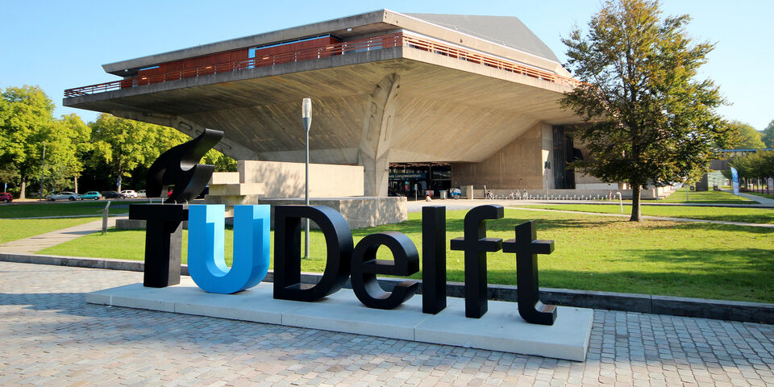

+++ { "kind": "split-image" }

## L1 & L2 Regularization in Machine Learning

+++

## About this material

These teaching materials were produced as part of the CSE3000 Research Project at the Faculty of Electrical Engineering, Mathematics and Computer Science (EEMCS), Delft University of Technology.

The goal is to give students a clear, accessible entry point into regularization — one of the most practically important ideas in supervised machine learning. The tutorial walks through Ridge (L2) and Lasso (L1) regression in detail, building from first principles. Readers are expected to have seen linear models and loss functions before, but no prior exposure to regularization is assumed.

## Contact

For questions, feedback, or suggestions regarding this material, feel free to reach out:

- **Author:** Ivan Nikolov
- **Email:** <inikolov@tudelft.nl>
- **Responsible Professor:** Gosia Migut
- **Supervisor:** Ilinca Rențea
- **Institution:** TU Delft — EEMCS — Computer Science and Engineering
